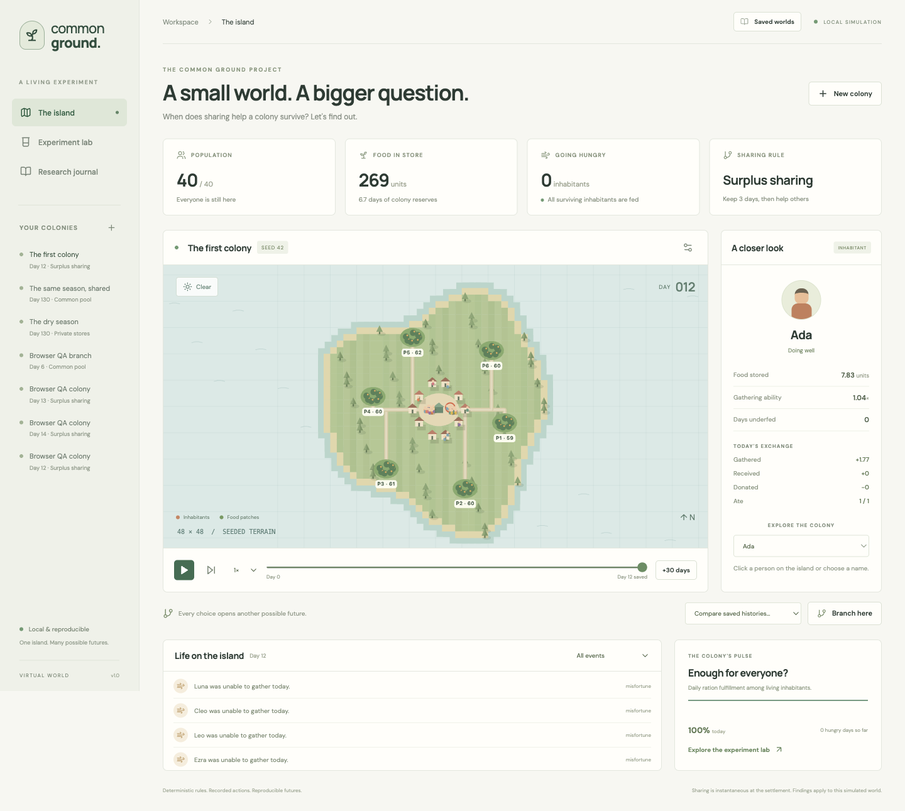
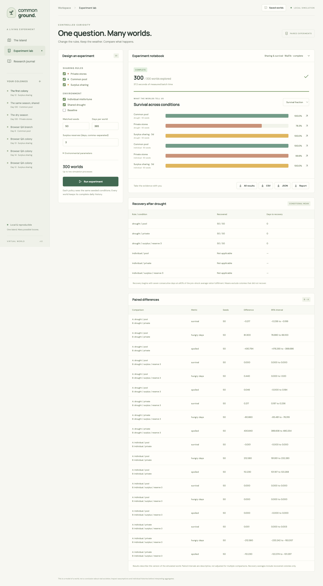
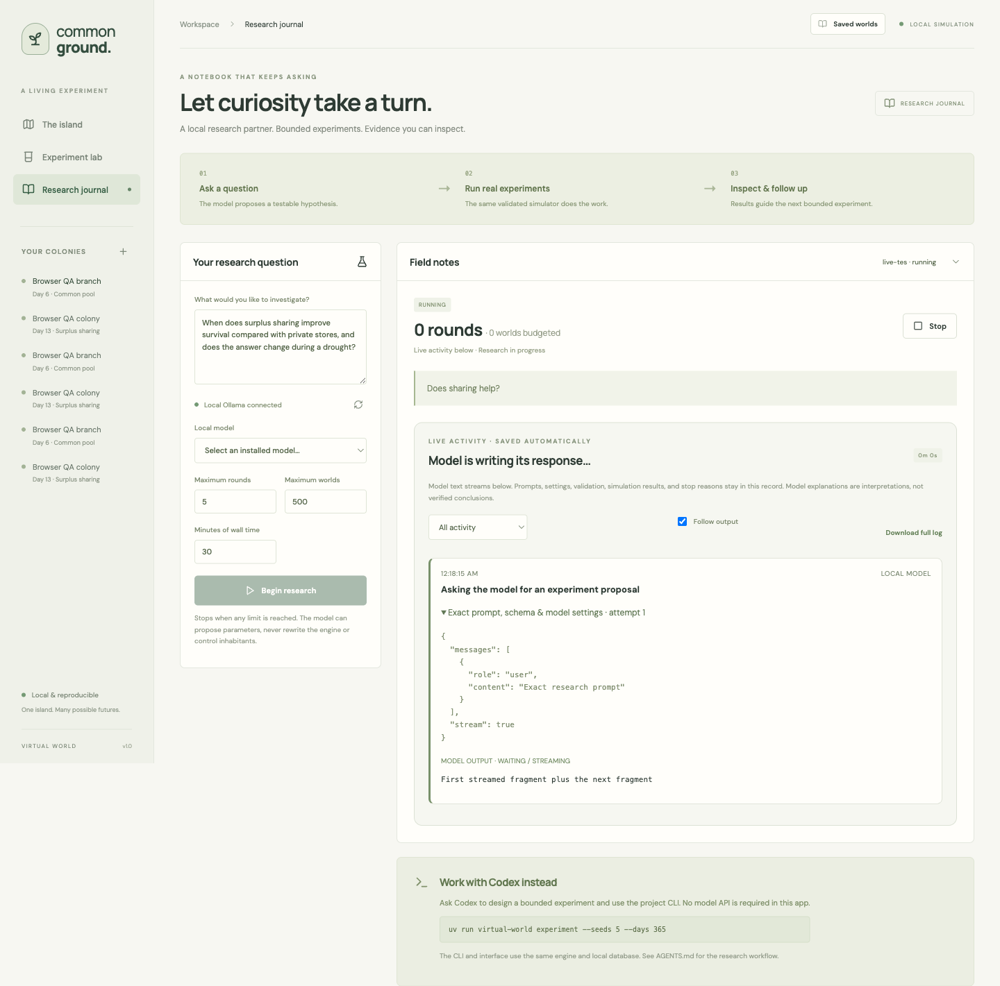

# World Simulation LLMs

**A small world. A bigger question.** A local, reproducible colony simulator where an LLM can suggest experiments, but the simulation itself stays deterministic and inspectable.



World Simulation LLMs is a little research environment for asking questions about cooperation. You can watch a colony gather food, change the sharing rules, replay what happened, and compare hundreds of matched worlds. The point is not to produce a grand theory of society. The point is to make the assumptions visible enough that you can disagree with the result.

<p align="center">
  
  
</p>

## Why this exists

Most simulation demos hide the interesting parts behind a final chart. This project keeps the trail: the seed, the weather, the food ledger, every daily checkpoint, the experiment configuration, and the local model's proposal. You can inspect one inhabitant or zoom out to a 300-world batch without switching tools.

## Start

Requirements: Python 3.11+, [uv](https://docs.astral.sh/uv/), Node.js 20.19+ (or 22.12+), npm. Python 3.12 is recommended.

```sh
uv run python scripts/dev.py
```

Open **http://127.0.0.1:5173**. The command installs Python and, if needed, frontend dependencies and starts both services. Ctrl-C stops both. No model or API key is needed for the island or experiment lab.

For a built local app:

```sh
npm --prefix web install
npm --prefix web run build
uv run virtual-world serve
```

Open **http://127.0.0.1:8765**. Interactive API documentation is at `/docs`.

## Explore

- **The island:** play/pause, change speed, step one day, or simulate 30 days. Click an inhabitant or select their name to inspect actual food flows. Scrub any saved day.
- **Branch here:** choose a new sharing policy or reserve threshold, or record an external food grant. The original history remains intact. Compare two saved histories on a shared timeline.
- **Experiment lab:** compare policies, environments, and reserve thresholds across matched seeds. Every run retains a replay. Charts and tables report survival, hunger, spoilage, recovery, and paired bootstrap intervals. Export a ZIP, CSV, JSON, or factual Markdown report.
- **Research journal:** optionally use an installed local Ollama model to propose and interpret bounded experiments. Measured results and model interpretations are presented separately. The local researcher never controls inhabitants.

## The model

The 48×48 seeded island has a connected landmass, ten homes, six food patches, and 40 inhabitants by default. Each day: weather and regrowth → travel/gather → return → sharing → consumption → spoilage → survival checks. Distance reduces gathering yield. Gatherers divide a contested patch proportionally to their requested harvest. The same gathering strategy is used for every policy. Stable individual ability and independent daily incapacity introduce heterogeneity.

Private stores retain personal food. A common pool allocates equal rations. Surplus sharing transfers food above the configured reserve to inhabitants with unmet daily needs. Reserves include today's ration, so a zero reserve can give away food needed by the donor. Transfers are instantaneous at the settlement. When exiting a common pool, its food is divided equally among survivors; entering it aggregates existing stores. Branch grants are externally supplied food and are logged.

Defaults: 1 food/day ration; 4 initial units/person; 2.4 base gathering yield reduced by travel; 13 patch regrowth/day before weather adjustment; 70 patch capacity; 3.5% daily store spoilage; death after 7 consecutive underfed days. Individual-misfortune scenarios use a 20% daily gathering-failure probability. Baseline and drought scenarios retain a 3% background failure probability. Default drought runs from day 90 through 109, reducing both patch regrowth and gathering productivity by 70%. These two environmental scenarios are distinct packages of assumptions, not a matched equal-severity comparison.

Recovery is measured from the end of the drought to the beginning of seven consecutive days at ≥90% of the seven-day pre-shock average ration fulfillment. It is conditional on those still alive: a colony can lose inhabitants and subsequently recover its ration fulfillment. The UI also shows survival and the number of recovered runs to avoid hiding this distinction. No shock is “not applicable”; an observed shock without recovery is “not recovered.”

Food conservation concerns food held by inhabitants and the common store: opening + harvest + grants = closing + eaten + spoiled + food lost on death. Food in nature is tracked separately. The engine records all terms. Random inputs are keyed by seed, day, entity, and event kind, independent of policy execution order. Browser animation does not influence state.

## Experiments and CLI

```sh
uv run virtual-world run --days 30 --name 'First colony'
uv run virtual-world experiment --seeds 50 --days 365
uv run virtual-world inspect EXPERIMENT_ID
uv run virtual-world report EXPERIMENT_ID --output outputs/report.md
uv run virtual-world experiment --resume EXPERIMENT_ID
uv run virtual-world inspect RUN_ID --day 20
uv run virtual-world branch RUN_ID --day 20 --policy pool --food-grant 10
```

Use `--config path.json` on `run` or `experiment` for all validated configuration fields. An experiment example:

```json
{
  "name": "Does keeping a larger reserve help?",
  "policies": ["private", "surplus"],
  "conditions": ["individual", "drought"],
  "reserves": [0, 1, 3, 5, 10],
  "seeds": 5,
  "seed_start": 2000,
  "base": {"duration": 365}
}
```

Run workers share a global two-process pool. Cancelled batches retain checkpoints and can resume without repeating completed worlds. Server startup marks unfinished jobs interrupted. Do not run multiple servers against the same database. CLI batches can run while the server is already running, but avoid restarting the server during them.

SQLite storage is `.data/world.sqlite3`; override via `VIRTUAL_WORLD_DB` or `virtual-world --db PATH ...`. Checkpoints are compressed. The measured default 300-world benchmark uses about 449 MB; future batches accumulate storage. Archives export configs, metrics, and reports; complete replays stay in the local database. Back up the database using SQLite's backup API while the server is active, or copy it after all services stop and WAL is checkpointed.

## Local research

Start Ollama separately and install a model suitable for your hardware. In the Research journal select an installed **local** model explicitly. No model downloads or cloud fallbacks occur. For additional runtime isolation, start Ollama with `OLLAMA_NO_CLOUD=1 ollama serve`. Defaults: 5 rounds, 500 worlds, 30 minutes; the first exhausted limit stops the session. A model request has a maximum 60-second timeout, capped by remaining wall time. Invalid JSON or an over-budget proposal gets one retry. Structural JSON constraints are sent to Ollama; the full Pydantic bounds are enforced again in Python. Proposals may only select allowed simulator parameters. Confirmation requests reuse an earlier experiment with fresh engine-assigned seeds. User stop cancels the active batch; an in-flight local model call may take until its timeout to return.

```sh
uv run virtual-world research --model YOUR_LOCAL_MODEL --question 'Does sharing help during a drought?' --rounds 2 --max-runs 60 --minutes 10
uv run virtual-world research --inspect SESSION_ID
uv run virtual-world research --stop SESSION_ID
```

Codex can instead run the CLI directly; see [AGENTS.md](AGENTS.md). No scheduler is configured by this project.

## Verification

```sh
uv sync --extra dev
uv run pytest -q
uv run python scripts/generate_types.py
npm --prefix web run build
# With Chrome installed (tests start their own isolated server on :8766):
npm --prefix web test
```

See `outputs/benchmark-report.md` for the full 300-run experiment's actual measurements. Findings apply to this version of the simulation, not to real societies. Bootstrap intervals are descriptive and are not corrected for multiple comparisons.

### Live research activity

Open **Research journal** and begin a new session. **Live activity** shows the exact
Ollama prompts and settings, streamed response text, optional reasoning text returned
by the local model, validation and retries, configured experiments, each world's
start/completion, measured results, and the final stop reason. Expand an event to
inspect its full recorded data. Use the filter and Follow output control to read
earlier events while work continues.

Activity is saved in SQLite independently of the browser. Reloading or selecting
a saved session restores its transcript. **Download full log** exports the session
and all events as JSON. Older sessions have no retroactive model transcript.
The browser fetches incremental events every 600 ms; model fragments are batched
roughly every 150 ms. This displays text exposed by the Ollama API, not internal
model state that the API does not return.
